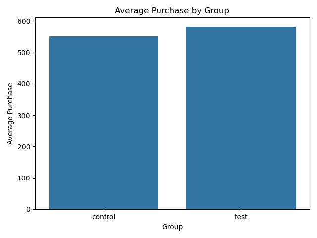

# A/B Testing: Comparison of Bidding Methods on Conversion

This project aims to analyze whether a new bidding method introduced by Facebook (Average Bidding) leads to more conversions (purchases) than the existing method (Maximum Bidding).

## Business Problem
An e-commerce company wants to test if the new **Average Bidding** method results in more purchases compared to the old **Maximum Bidding** strategy. An A/B test was conducted over one month.

- **Control Group**: Maximum Bidding  
- **Test Group**: Average Bidding  
- **Main Metric**: Purchase count

---

## 📊 Dataset
The dataset includes:

- `Impression`: Number of times ads are shown  
- `Click`: Number of times ads are clicked  
- `Purchase`: Number of purchases  
- `Earning`: Revenue from purchases  
- `Group`: control/test identifier

Data is taken from two different sheets (Control Group & Test Group) and merged into a single DataFrame.

---

## ✅ Steps

### 1. Data Understanding
- Checked data shape, types, nulls, and quantiles.

### 2. Hypothesis
- **H0**: The average `Purchase` of both groups is equal.  
- **H1**: The average `Purchase` of the groups is different.

### 3. Assumption Checks
- **Shapiro-Wilk Test** for normality (p > 0.05 → normal)
- **Levene’s Test** for equal variance (p > 0.05 → homogeneity)

Both assumptions were met ✅

### 4. Hypothesis Testing
Used independent t-test since assumptions were valid.  
- **p-value ≈ 0.35** → Fail to reject H0  
→ **No statistically significant difference** between the two groups.

---

## Visualization

Below is a bar plot comparing average purchases of both groups:

---

## Conclusion

There is no statistically significant evidence that the new bidding method performs better. Therefore, it’s suggested to continue with the existing **Maximum Bidding** method for now. Further testing on a larger sample might be beneficial.

---

## 🛠️ Libraries Used
- pandas
- numpy
- matplotlib
- seaborn
- scipy

---
## What I Learned

- How to design and run an A/B test
- How to apply statistical tests (Shapiro, Levene, T-test)
- Assumption checking and interpretation of p-values
- Data visualization and communication of results

## 👩‍💻 Notes
This project was completed as part of my data science learning journey and portfolio building.
